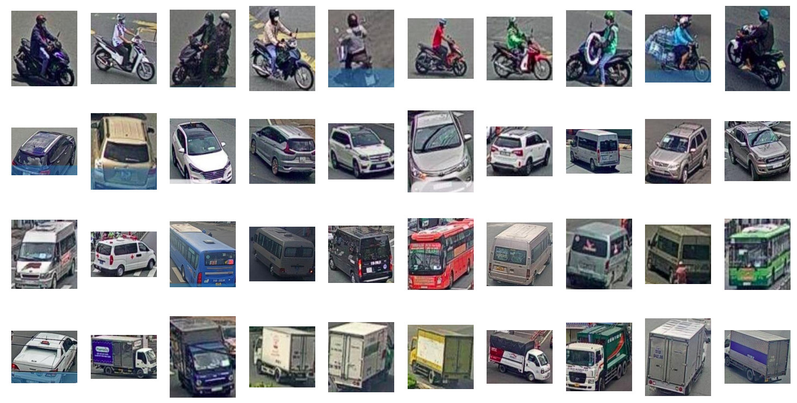
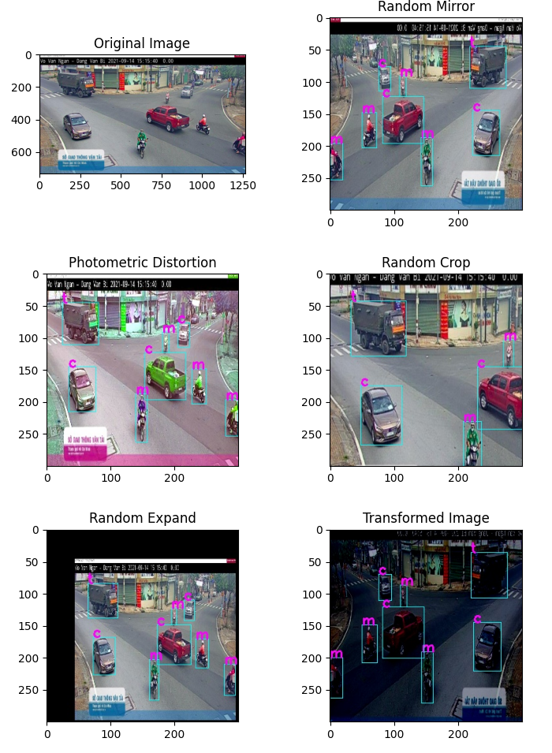
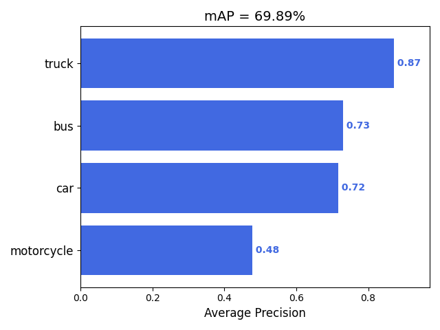

# vehicle_detection

The website is used to identify vehicles, assess and visualize traffic conditions in Ho Chi Minh City, Vietnam

## Data
Data is get from real time camera data from [Cong Thong Tin Giao Thong Thanh Pho Ho Chi Minh](http://giaothong.hochiminhcity.gov.vn/map.aspx)

Data Summary:
- Num of picture: 2586
- Num of object: 16753
- Num of class: 4 (motorcycle, car, bus, truck)
- Resolution of picture: 800x450

|  Class  |  motorcycle  |  car  |  bus  |  truck  |
|  ---  |  ---  |  ---  |  ---  |  ---  |
| Amount  |  12912  |  2085  |  411  |  1345  |

Data Augmentation
- Random Mirror
- Photometric Distortion
- Random Crop
- Random Expand
- Subtract Means

## Model
Using **SSD Architecture** with **VGG16** backbone. Pretrained model from [qfgaohao - pytorch-ssd](https://github.com/qfgaohao/pytorch-ssd#vgg-ssd)

mAP Accuracy

## Application
Web development with [Streamlit](https://streamlit.io)

Web link [here](https://share.streamlit.io/lenguyengiabao/vehicle_detection/app.py)

Feature: 
- Detect Vehicles
    - From realtime data
    - From image
    - From video
- Visualize Realtime Information With Charts
- Notifications When Traffic Jams With [Slack](https://slack.com)

How to use
- Realtime data: Choose `Run on Live Camera`, choose camera name and set threshold. 

  Note: The data is updated each **15** seconds. It's because of camera from Cong Thong Tin Giao Thong Thanh Pho Ho Chi Minh
- Image data: Choose `Run on Image` and upload your image
- Video data: Choose `Run on Video` and upload your video. You can check `Record Video` to save output video.